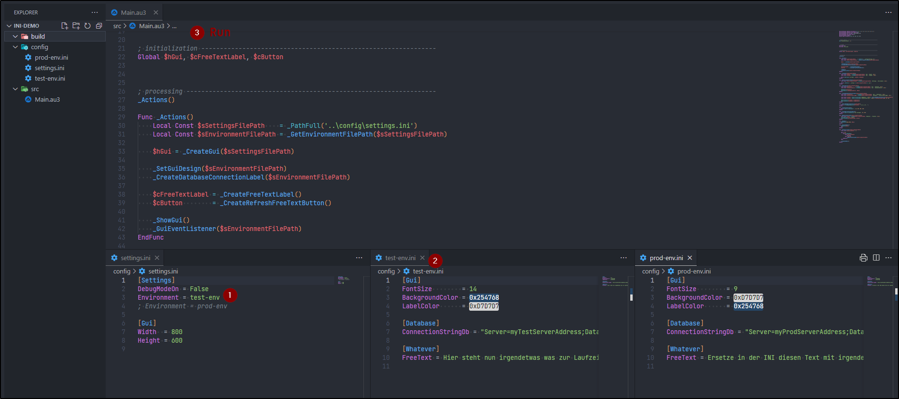
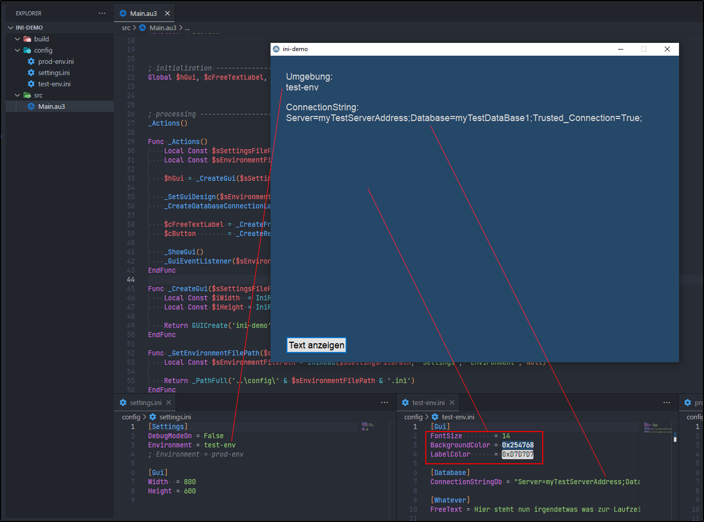
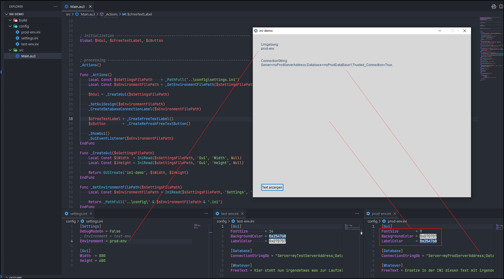
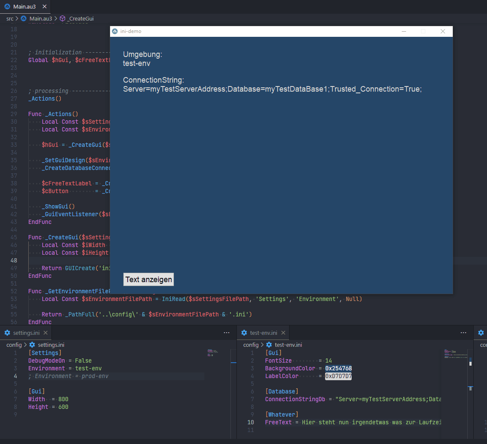

### 💡 Please notice: The following text/post was created as a forum [forum thread](https://autoit.de/thread/87936-beispiele-gedanken-und-tipps-bei-der-nutzung-von-ini-dateien/?postID=710114#post710114). So don't be confused, this is more like a reverse link.

---

## Konkretes Beispiel zur Verwendung/Nutzung mehrere INI-Dateien

Hi zusammen 👋 ,

wie angekündigt hier endlich das konkrete Beispiel von mir, zu einer Möglichkeit wie man mehrere INIs verwenden/nutzen kann.

💡 Wichtig zu wissen ist:

- **Allgemein**, gehe ich davon aus, dass das jeweilige Programm/Skript (unabhängig vom folgenden Beispiel) zu einer Exe kompiliert wurde und somit kein direkter Einfluss auf das Programm gegeben ist bzw. der Code nicht einfach geändert werden kann.
  - Denn ansonsten braucht es auch keine INI, wenn man es direkt im Code konfiguriert.
- **Nutzer**, der Anwendung (wie Dritte, Außenstehende (Stakeholder bspw.)), kennen sich mit dem Programm und dessen Code nicht aus, wollen jedoch dennoch etwas am Programm beeinflussen/ändern.
  - Dies wäre **eine** Verwendung von Konfigurationsdateien, wie einer INI.
  - **Eine weitere** Verwendung ist ein Deployment der Anwendung auf verschiedene Server/Maschinen mit verschiedenen Konfigurationen.
- Das folgenden **Beispiel** ist bitte auch als Beispiel zu betrachten. Es soll nur darstellen, wie INIs zur Konfiguration dienen/genutzt werden können.
  - Also bitte keine Hinweise das dies oder jenes nicht sinnvoll ist oder keinem echten Anwendungsfall entspricht.
  - Wobei ich mir Mühe gegeben habe, es nicht zu trivial zu gestalten 🤞 .

🎲 Werden wir mal etwas konkreter. Um meinem Beispiel zu folgen, kann mittels folgendem Skripts die Struktur (Ordner- und Datei-Struktur) angelegt werden.

``` autoit
#AutoIt3Wrapper_AU3Check_Parameters=-d -w 1 -w 2 -w 3 -w 4 -w 5 -w 6 -w 7
#AutoIt3Wrapper_AU3Check_Stop_OnWarning=y
#AutoIt3Wrapper_Run_Au3Stripper=y
#AutoIt3Wrapper_UseUpx=n
#Au3Stripper_Parameters=/sf /sv /mo /rm /rsln

_Actions()

Func _Actions()
    Local Const $sRootPath    = @DesktopDir
    Local Const $sProject     = 'ini-demo'
    Local Const $sProjectPath = _AddTrailingBackslash($sRootPath) & _AddTrailingBackslash($sProject)

    _SetupFolderStructure($sProjectPath)
    _CreateInitialFiles($sProjectPath)

    _PrefillMainSourceFile($sProjectPath & 'src\Main.au3')
    _PrefillSettingsIniFile($sProjectPath & 'config\settings.ini')
    _PrefillTestEnvironmentIniFile($sProjectPath & 'config\test-env.ini')
    _PrefillProdEnvironmentIniFile($sProjectPath & 'config\prod-env.ini')
EndFunc

Func _SetupFolderStructure($sProjectPath)
    Local Const $aFolderList[] = _
        [ _
            'build', _
            'config', _
            'src' _
        ]

    For $sFolder In $aFolderList
        DirCreate($sProjectPath & $sFolder)
    Next
EndFunc

Func _CreateInitialFiles($sProjectPath)
    Local Const $aFileList[] = _
        [ _
            'config\prod-env.ini', _
            'config\settings.ini', _
            'config\test-env.ini', _
            'src\Main.au3' _
        ]

    For $sFile In $aFileList
        _WriteFile($sProjectPath & $sFile, '')
    Next
EndFunc

Func _PrefillMainSourceFile($sMainFile)
    Local Const $aLineList[] = _
        [ _
            '#AutoIt3Wrapper_AU3Check_Parameters=-d -w 1 -w 2 -w 3 -w 4 -w 5 -w 6 -w 7\r\n', _
            '#AutoIt3Wrapper_AU3Check_Stop_OnWarning=y\r\n', _
            '#AutoIt3Wrapper_Outfile_x64=..\build\Main.exe\r\n', _
            '#AutoIt3Wrapper_Run_Au3Stripper=y\r\n', _
            '#AutoIt3Wrapper_UseUpx=n\r\n', _
            '#Au3Stripper_Parameters=/sf /sv /mo /rm /rsln\r\n\r\n\r\n\r\n', _
            '; autoit options ---------------------------------------------------------------\r\n', _
            'Opt(''MustDeclareVars'', 1)\r\n\r\n\r\n\r\n', _
            '; includes ---------------------------------------------------------------------\r\n', _
            '#include-once\r\n', _
            '#include <File.au3>\r\n\r\n\r\n\r\n', _
            '; initialization ---------------------------------------------------------------\r\n', _
            'Global $hGui, $cFreeTextLabel, $cButton\r\n\r\n\r\n\r\n', _
            '; processing -------------------------------------------------------------------\r\n', _
            '_Actions()\r\n\r\n', _
            'Func _Actions()\r\n', _
            '    Local Const $sSettingsFilePath    = _PathFull(''..\config\settings.ini'')\r\n', _
            '    Local Const $sEnvironmentFilePath = _GetEnvironmentFilePath($sSettingsFilePath)\r\n\r\n', _
            '    $hGui = _CreateGui($sSettingsFilePath)\r\n\r\n', _
            '    _SetGuiDesign($sEnvironmentFilePath)\r\n', _
            '    _CreateDatabaseConnectionLabel($sEnvironmentFilePath)\r\n\r\n', _
            '    $cFreeTextLabel = _CreateFreeTextLabel()\r\n', _
            '    $cButton        = _CreateRefreshFreeTextButton()\r\n\r\n', _
            '    _ShowGui()\r\n', _
            '    _GuiEventListener($sEnvironmentFilePath)\r\n', _
            'EndFunc\r\n\r\n', _
            'Func _CreateGui($sSettingsFilePath)\r\n', _
            '    Local Const $iWidth  = IniRead($sSettingsFilePath, ''Gui'', ''Width'', Null)\r\n', _
            '    Local Const $iHeight = IniRead($sSettingsFilePath, ''Gui'', ''Height'', Null)\r\n\r\n', _
            '    Return GUICreate(''ini-demo'', $iWidth, $iHeight)\r\n', _
            'EndFunc\r\n\r\n', _
            'Func _GetEnvironmentFilePath($sSettingsFilePath)\r\n', _
            '    Local Const $sEnvironmentFilePath = IniRead($sSettingsFilePath, ''Settings'', ''Environment'', Null)\r\n\r\n', _
            '    Return _PathFull(''..\config\'' & $sEnvironmentFilePath & ''.ini'')\r\n', _
            'EndFunc\r\n\r\n', _
            'Func _SetGuiDesign($sEnvironmentFilePath)\r\n', _
            '    Local Const $iFontSize        = IniRead($sEnvironmentFilePath, ''Gui'', ''FontSize'', Null)\r\n', _
            '    Local Const $vBackgroundColor = IniRead($sEnvironmentFilePath, ''Gui'', ''BackgroundColor'', Null)\r\n\r\n', _
            '    GUISetFont($iFontSize)\r\n', _
            '    GUISetBkColor($vBackgroundColor, $hGui)\r\n', _
            'EndFunc\r\n\r\n', _
            'Func _CreateDatabaseConnectionLabel($sEnvironmentFilePath)\r\n', _
            '    Local Const $vLabelColor         = IniRead($sEnvironmentFilePath, ''Gui'', ''LabelColor'', Null)\r\n', _
            '    Local Const $sConnectionStringDb = IniRead($sEnvironmentFilePath, ''Database'', ''ConnectionStringDb'', Null)\r\n\r\n', _
            '    Local Const $cLabel1 = GUICtrlCreateLabel(''Umgebung:'' & @CRLF & _GetFileNameWithoutExtension($sEnvironmentFilePath), 30, 30)\r\n', _
            '    Local Const $cLabel2 = GUICtrlCreateLabel(''ConnectionString:'' & @CRLF & $sConnectionStringDb, 30, 90)\r\n\r\n', _
            '    GUICtrlSetColor($cLabel1, $vLabelColor)\r\n', _
            '    GUICtrlSetColor($cLabel2, $vLabelColor)\r\n', _
            'EndFunc\r\n\r\n', _
            'Func _GetFileNameWithoutExtension($sFilePath)\r\n', _
            '    Return StringRegExpReplace($sFilePath, ''^.*\\|\..*$'', '''')\r\n', _
            'EndFunc\r\n\r\n', _
            'Func _CreateFreeTextLabel()\r\n', _
            '    Return GUICtrlCreateLabel('''', 30, 300, 600, 200)\r\n', _
            'EndFunc\r\n\r\n', _
            'Func _CreateRefreshFreeTextButton()\r\n', _
            '    Return GUICtrlCreateButton(''Text anzeigen'', 30, 550)\r\n', _
            'EndFunc\r\n\r\n', _
            'Func _UpdateFreeTextLabel($sEnvironmentFilePath)\r\n', _
            '    Local Const $sText = IniRead($sEnvironmentFilePath, ''Whatever'', ''FreeText'', Null)\r\n', _
            '    ConsoleWrite($sText & @CRLF)\r\n', _
            '    GUICtrlSetData($cFreeTextLabel, $sText)\r\n', _
            'EndFunc\r\n\r\n', _
            'Func _ShowGui()\r\n', _
            '    GUISetState(@SW_SHOW, $hGui)\r\n', _
            'EndFunc\r\n\r\n', _
            'Func _DisposeAndExit()\r\n', _
            '    GUIDelete($hGui)\r\n', _
            '    Exit\r\n', _
            'EndFunc\r\n\r\n', _
            'Func _GuiEventListener($sEnvironmentFilePath)\r\n', _
            '    Local Const $iGuiCloseEvent = -3\r\n\r\n', _
            '    While True\r\n', _
            '        Switch GUIGetMsg()\r\n', _
            '            Case $iGuiCloseEvent\r\n', _
            '                ExitLoop\r\n', _
            '            Case $cButton\r\n', _
            '                _UpdateFreeTextLabel($sEnvironmentFilePath)\r\n', _
            '        EndSwitch\r\n', _
            '    WEnd\r\n\r\n', _
            '    _DisposeAndExit()\r\n', _
            'EndFunc\r\n' _
        ]

    For $sLine In $aLineList
        _AppendToFile($sMainFile, StringReplace($sLine, '\r\n', @CRLF))
    Next
EndFunc

Func _PrefillSettingsIniFile($sSettingsFile)
    Local Const $aLineList[] = _
        [ _
            '[Settings]\r\n', _
            'DebugModeOn = False\r\n', _
            'Environment = test-env\r\n', _
            '; Environment = prod-env\r\n', _
            '\r\n', _
            '[Gui]\r\n', _
            'Width  = 800\r\n', _
            'Height = 600\r\n' _
        ]

    For $sLine In $aLineList
        _AppendToFile($sSettingsFile, StringReplace($sLine, '\r\n', @CRLF))
    Next
EndFunc

Func _PrefillTestEnvironmentIniFile($sSettingsFile)
    Local Const $aLineList[] = _
        [ _
            '[Gui]\r\n', _
            'FontSize        = 14\r\n', _
            'BackgroundColor = 0x254768\r\n', _
            'LabelColor      = 0xD7D7D7\r\n\r\n', _
            '[Database]\r\n', _
            'ConnectionStringDb = "Server=myTestServerAddress;Database=myTestDataBase1;Trusted_Connection=True;"\r\n\r\n', _
            '[Whatever]\r\n', _
            'FreeText = Hier steht nun irgendetwas was zur Laufzeit immer wieder eingelesen wird, wenn der Button "Text anzeigen" verwendet wird.\r\n' _
        ]

    For $sLine In $aLineList
        _AppendToFile($sSettingsFile, StringReplace($sLine, '\r\n', @CRLF))
    Next
EndFunc

Func _PrefillProdEnvironmentIniFile($sSettingsFile)
    Local Const $aLineList[] = _
        [ _
            '[Gui]\r\n', _
            'FontSize        = 9\r\n', _
            'BackgroundColor = 0xD7D7D7\r\n', _
            'LabelColor      = 0x254768\r\n\r\n', _
            '[Database]\r\n', _
            'ConnectionStringDb = "Server=myProdServerAddress;Database=myProdDataBase1;Trusted_Connection=True;"\r\n\r\n', _
            '[Whatever]\r\n', _
            'FreeText = Ersetze in der INI diesen Text mit irgendeinen anderen und nutze den "Text anzeigen" Button.\r\n' _
        ]

    For $sLine In $aLineList
        _AppendToFile($sSettingsFile, StringReplace($sLine, '\r\n', @CRLF))
    Next
EndFunc

Func _AddTrailingBackslash($sPath)
    Return (StringRight($sPath, 1) == '\') ? $sPath : $sPath & '\'
EndFunc

Func _WriteFile($sFile, $sText)
    Local Const $iUtf8WithoutBomAndOverwriteCreationMode = 256 + 2 + 8

    Local $hFile = FileOpen($sFile, $iUtf8WithoutBomAndOverwriteCreationMode)
    FileWrite($hFile, $sText)
    FileClose($hFile)
EndFunc

Func _AppendToFile($sFile, $sText)
    Local Const $iUtf8WithoutBomAndAppendMode = 256 + 1

    Local $hFile = FileOpen($sFile, $iUtf8WithoutBomAndAppendMode)
    FileWrite($hFile, $sText)
    FileClose($hFile)
EndFunc
```
Hiermit wird auf dem Desktop das Verzeichnis **ini-demo** angelegt. Danach kann die `Main.au3` (das eigentliche Beispiel) verwendet werden. Oder man kompiliert das Programm und führt die Exe im **build** Verzeichnis aus.

👓 Das Ganze sieht dann so aus:



Es gibt die `settings.ini` welche allgemeine Einstellungen beinhaltet, aber auch die Schlüssel "Environment", dessen Wert festlegt welche spezifische Konfiguration (eine weitere INI-Datei) verwendet werden soll. Hierbei gibt es den Wert **test-env** und **prod-env**. Je nachdem was in der `settings.ini` ausgewählt wird, sieht die GUI (welche ich zur Darstellung des Beispiels verwende) unterschiedlich aus.

👓 test-env:



👓 prod-env:



(1) Der erste Anwendungsfall ist somit die Verwendung von Sub-Konfigurationen, die spezifisch für eine Umgebung gedacht sind. Der Wechsel des Wertes, vom Schlüssel "Environment", in der `settings.ini` bewirkt die unterschiedlichen Darstellungen und angezeigten Labels, je nach Umgebung. Greifbarer ist sicherlich die Datenbankverbindung, welche mit **ConnectionStringDb** in der jeweiligen Sub-INI (`test-env.ini` oder `prod-env.ini`) dargestellt ist.

(2) Als zweites Beispiel für die Verwendung von INIs greife ich hier das Aktualisieren von Texten der GUI, zur Laufzeit des Programmes auf. Also wenn der Button "Text anzeigen" gedrückt wird, aktualisiert sich der Label-Text, welcher in der jeweiligen INI hinterlegt ist. Anders als beim Beispiel (1), bei dem nur einmalig die INI-Werte (der Sektionen "GUI" und "Database") gelesen werden, wird hier im Beispiel (2) die INI immer erneut befragt und liefert den dort geänderten Text zurück.

👓 INI-Nutzung zur Laufzeit:



💡 Dies ist zunächst ein Zwischenstand. Ich werde diesen post sicherlich nochmal umformulieren und weiter beschreiben, jedoch erhoffe ich mir jetzt bereits, dass es verständlich ist. Ich freue mich über euer Feedback, Kritik in jeglicher Form oder einfach über Fragen dazu 🤝 .

Viele Grüße<br>
Sven
