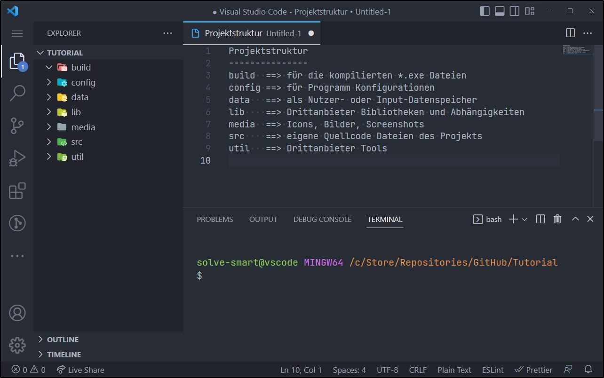
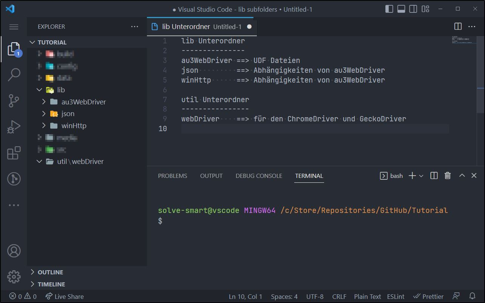

 

 

 

 

<h1 align="center">AutoIt Tutorial: WebDriver</h1>
<h3 align="center">Dein Einstieg in das "au3WebDriver" Projekt</h3>

 

| [Einführung](#-einführung) | [Projektstruktur](#-projektstruktur) |

| [Au3WebDriver](#-au3webdriver) | [Abhängigkeiten](#-abhängigkeiten) | [Setup](#-setup) |

| [Selektoren](#-selektoren) | [Anwendungsbeispiele](#-anwendungsbeispiele) | [Ein Ausblick](#-ein-ausblick) |

 
 

## ➀ Einführung

### Legende

| Symbol | Beschreibung                       |
| :---:  | :---                               |
| 🔊     | Audio-Kommentar                    |
| 📑     | Unter-Kapitel                      |
| 🎲     | Abkürzung (Setup Skript für Faule) |

 

### 🔊 Willkommen

<audio src="./media/audio/01-01-introduction.mp3" controls="controls"></audio>

 

### 📑 An wen richtet sich dieses Tutorial

Wenn du dich bereits mit AutoIt wohl fühlst, doch noch keine Berührungspunkte mit dem WebDriver bzw. dem au3WebDriver Projekt hattest, bist du hier richtig. Vielleicht wolltest du schon mal mit dem WebDriver beginnen und warst dir unsicher wie du starten solltest, trotz Dokumentation, einfach zu komplex auf dem ersten Blick? Dann lass dich von diesem praxisnahen Tutorial unterstützen und lass uns gemeinsam die ersten Hürden aus dem Weg räumen.

Du bist dir noch immer unsicher? Dann frage dich einmal ob du in der Vergangenheit mit der `IE.au3` UDF gearbeitet hast; ob du in irgendeiner Art und Weise einen Browser bzw. Webseiten automatisieren wolltest/musstest; ob du den Seiten Quellcode oder Teile davon extrahieren wolltest um die Informationen später weiter zu verarbeiten; ob du bspw. mit `InetGet()` nicht das Ergebnis bekommen hast, welches du dir erhofft hast? Dann ist dieses Tutorial deine Zeit wert. Auch wenn du sehr wahrscheinlich nicht alle Antworten auf deine konkreten Anwendungsfälle bekommen wirst, eröffnet dir dieses Tutorial neue Möglichkeiten bzgl. dieser oder anderer Fragestellungen im Bereich WEB.

Falls hiervon nichts bisher auf dich zu trifft und du einfach nur interessiert bist um was es geht, dann auch für dich: viel Spaß.

An sich empfehle ich Anwendern mit **Level B1** aufwärts, dieses Tutorial. Die Level-Tabelle dient jedoch nur der Orientierung und stellt eine Einstufungshilfe dar, daher lass dich nicht verunsichern und traue dich einfach.

📊 Level-Tabelle (Kontext AutoIt)

| Level  | Bezeichnung                            | Beschreibung                                                                    |
| :---   | :---                                   | :---                                                                            |
| A1     | Anfänger                               | Hat mit AutoIt und seinen Konzepten begonnen                                    |
| A2     | Anwender mit grundlegenden Kenntnissen | Hat erste Skripte (meist noch mit Unterstützung) geschrieben                    |
| **B1** | Fortgeschrittener Anwender             | Kann erste Problemstellungen selbstständig bewältigen                           |
| B2     | Erfahrener Anwender                    | Kann komplexere Programme entwickeln                                            |
| C1     | Fachkundiger Anwender                  | Kann sein AutoIt Breitenwissen in Bereiche wie backend, frontend, API einsetzen |
| C2     | Experte                                | Kann sein AutoIt Breitenwissen einsetzen und fundiert weiter geben (vermitteln) |

 

### 📑 Was erwartet dich

In diesem Tutorial werde ich u. a. auf die folgenden Schwerpunkte eingehen:

- Kurze Erläuterung zur W3C WebDriver Spezifikation.
- Flexible Projektstruktur erstellen.
- Wie nutzt du das au3WebDriver Projekt (samt Abhängigkeiten) für dich.
- WebDriver Optionen und Funktionen.
- XPath Selektoren aufbauen und nutzen.
- Anwendungsfälle wie Navigation, Interaktion mit Elementen, die Verwendung des Browser headless Modus und mehr.
- Wie geht man mit mehreren Browser Tabs um.
- Abrufen des Seitenquellcodes.
- Page Object Model für weniger Redundanz, mehr Struktur und Übersicht.

Auf die folgenden Schwerpunkte werde ich in diesem Tutorial **nicht** eingeben:

- Was ist CDP (Chrome DevTools Protocol) und wie wird damit umgegangen?
- Helfer-Tools wie SelectorsHub (um die Erstellung von XPath-Selektoren zu vereinfachen).
- Wie wird eine Verbindung zu einer laufenden Browserinstanz hergestellt.
- Wie halte ich meine WebDriver-Umgebung auf dem neuesten Stand (auf automatisierte Weise).
- Fehlerbehebung (Troubleshooting) von häufigen Problemen.

Im Kapitel [Ein Ausblick](#-ein-ausblick) findest du weitere Themen die ggf. in folgenden Tutorials behandelt werden.

 

### 📑 Was solltest du danach wissen und können

Nach dem Tutorial sollte die Einrichtung, die Integration des WebDriver in dein eigenes Projekt und die Nutzung des au3WebDriver Projekt bei dir funktionieren. Du wirst wissen auf was du achten musst, um die ersten einfachen Anwendungsfälle umzusetzen. Des Weiteren wirst du wissen wo du weitere Informationen finden kannst und wie du dich an Hand der Demo ([wd_demo.au3](https://github.com/Danp2/au3WebDriver/blob/master/wd_demo.au3)) mit weiteren Möglichkeiten beschäftigen kannst.

 

### 📑 Was ist WebDriver

Ich möchte die **W3C WebDriver Spezifikation** auf ein verständliches Level herunterbrechen, ohne weitere Erklärungen oder tiefere Beschreibungen zum Wire-Protokoll und dessen Kommunikation bzw. Transfer-Weg (über Anfragen und Antworten (requests und responses)). Im Abschnitt weiter unten [Referenzen für mehr Details](#-referenzen-für-mehr-details) findest du die offizielle Spezifikation und die akkurate Definition zum WebDriver. Auch die Architektur des Wire-Protokolls ist für dieses praxisnahe Tutorial nicht so wichtig. Dennoch, einige Sätze weiter unten geben einen kleinen Einblick.

🏷 In wenigen Sätzen: WebDriver ist ein Client-Server-Protokoll was dir die Voraussetzung zur Automatisierung eines Browsers schafft. Clients senden Anforderungen, der Server interpretiert diese gemäß dem Wire-Protokoll und führt dann das Automatisierungsverhalten aus, welches durch die Implementierungsschritte in der Spezifikation definiert ist. Die WebDriver Spezifikation ermöglicht es, auf Grund definierter Endpunkte (und derer Eingaben und Ausgaben), so genannte Client-Bibliotheken zu implementieren um in verschiedenen Programmiersprachen und Plattform unabhängig, das Verhalten des Browsers zu steuern (den Browser zu automatisieren).

🏷 Grundlegender Aufbau (Architektur): Eine WebDriver-Sitzung, deren Zustand über Anforderungen hinweg durch ein "session id" Token aufrechterhalten wird, wird von Server und Client gemeinsam genutzt. Das Erstellen einer neuen Sitzung beinhaltet das Senden von Parametern in Form von [Fähigkeiten](#-driver-capabilities-fähigkeiten-setzen) (capabilities), die dem Server mitteilen, was du unter welchen Bedingungen automatisieren möchten. Der Server bereitet den entsprechenden Browser mit allen Modifikationen vor, wie in den Fähigkeiten angegeben, und die Sitzung läuft dann weiter. Automatisierungsbefehle und -antworten werden hin und her gesendet (gebunden an die session id), bis der Client eine Anforderung zum Löschen der Sitzung sendet, woraufhin der Browser und andere Ressourcen beendet oder bereinigt werden und die session id verworfen wird.

🏷 Was bedeutet dies für AutoIt: Es ist somit möglich eine solche Client-Bibliothek, man kann es auch als Wrapper für API-Aufrufe (oder im Slang von AutoIt als "UDF") bezeichnen, zu erstellen und damit der Spezifikation/der Endpunkte entlang das Browserverhalten steuern, respektive den Browser automatisieren. Genau dies macht die UDF/das Projekt "au3WebDriver".

 

### 📑 Was ist das au3WebDriver Projekt

Es ist im Grunde eine Client-Bibliothek oder eine Schicht über der WebDriver Spezifikation (ein Wrapper) in AutoIt, die es dir ermöglicht mit jedem Browser zu interagieren, der die W3C WebDriver Spezifikation unterstützt. Au3WebDriver bietet eine vereinfachte Möglichkeit, die verschiedenen API-Endpunkte der Spezifikation aufzurufen, indem spezifische Wrapper-Funktionen verwendet werden, die die Endpunkte darstellen und kapseln. Alles auf einer Codebasis, was bedeutet, dass du deinen bevorzugten Browser konfigurierst, indem du Optionen/Fähigkeiten setzt. Dann kannst du beginnen, mit dem Browser oder mit Seitenelementen zu interagieren.

Du hast vielleicht schon von **Selenium** gehört, dem wohl beliebtesten Framework zur Automatisierung von Browsern, welches die WebDriver API verwendet. Glücklicherweise haben wir mit au3WebDriver auch ein Framework in AutoIt. Wenn du an anderen Sprachen interessiert bist, sind hier einige wenige aufgelistet die auf WebDriver basieren.

- Selenium (für mehrere Sprachen)
- WebdriverIO (für mehrere Sprachen)
- Karate (für Java)
- Nightwatch.js (JavaScript)
- au3WebDriver (AutoIt)

 

### 📑 Referenzen für mehr Details

Referenzen:

|                                                                                                                      | Referenzen                                                                              | Beschreibung                                                                                                   |
| :---:                                                                                                                | :---                                                                                    | :---                                                                                                           |
|  | [W3C WebDriver](https://www.w3.org/TR/webdriver)                                        | Offizielle W3C WebDriver Spezifikation.                                                                        |
| 📚                                                                                                                   | [WebDriver Wiki](https://www.autoitscript.com/wiki/WebDriver)                           | Weitere Informationen zur UDF/zum Projekt (big picture, capabilities, troubleshooting etc.).                   |
| 📚                                                                                                                   | [WebDriver Diskussions-Threads](https://www.autoitscript.com/wiki/WebDriver#References) | Sieh dir den Abschnitt "References" im Wiki an, welcher die relevanten Forum Threads zum WebDriver auflistet.  |
| 📖                                                                                                                   | [Webdriver.chm](https://github.com/Danp2/au3WebDriver/blob/master/Webdriver.chm)        | Funktionen CHM Hilfe Datei welche beim UDF downlaod mit dabei ist.                                             |
| 🧾                                                                                                                   | [Endpunkte](https://github.com/jlipps/simple-wd-spec#list-of-all-endpoints)             | Liste aller Endpunkte und ihrer Verwendungen.                                                                  |
| 👁                                                                                                                   | [Demo/Beispiele](https://github.com/Danp2/au3WebDriver/blob/master/wd_demo.au3)         | In der wd_demo.au3 findest du diverse Beispiele wie die Funktionen der au3WebDriver UDF genutzt werden können. |

Downloads:

|                                                                                                      | Downloads                                                                     | Beschreibung                                   |
| :---:                                                                                                | :---                                                                          | :---                                           |
|     | [Chrome](https://sites.google.com/chromium.org/driver/downloads)              | ChromeDriver download vom offiziellen Bereich. |
|           | [Edge](https://developer.microsoft.com/en-us/microsoft-edge/tools/webdriver/) | MSEdgeDriver download vom offiziellen Bereich. |
|  | [Firefox](https://github.com/mozilla/geckodriver/releases/latest)             | GeckoDriver download aus dem letzten Release.  |
|        | [Opera](https://github.com/operasoftware/operachromiumdriver/releases/latest) | OperaDriver download aus dem letzten Release.  |

 

### 🔊 Kurze Zusammenfassung, Kapitel ➀

<audio src="./media/audio/01-02-summary.mp3" controls="controls"></audio>

 

[· zum Kapitelanfang ·](#-einführung)

 

## ➁ Projektstruktur

### 🔊 Der Charme der Struktur

<audio src="./media/audio/02-01-project-structure.mp3" controls="controls"></audio>

 

### 📑 Grundlegender Aufbau

Wir legen erstmal den Projekt-Ordner an, der in diesem Beispiel **Tutorial** heißt. Dieser Ordner erhält die folgenden sieben Unterordner.

Projekt Ordner

  

 

Nun bekommen die Ordner **lib** und **util** noch Unterordner.

Unterordner

  

 

🎲 Damit dies etwas einfacher für dich ist, hier ein code snippet, damit du die Struktur schnell anlegen kannst.

_SetupProjectStructure()

<pre><code class="language-php">_SetupProjectStructure()

Func _SetupProjectStructure($sRootPath = @DesktopDir)
    Local Const $sProject     = 'Tutorial'
    Local Const $sProjectPath = _AddTrailingBackslash($sRootPath) & _AddTrailingBackslash($sProject)

    Local Const $aFolderList[] = _
        [ _
            'build', _
            'config', _
            'data', _
            'lib', _
            'lib\au3WebDriver', _
            'lib\json', _
            'lib\winHttp', _
            'media', _
            'src', _
            'util', _
            'util\webDriver' _
        ]

    For $sFolder In $aFolderList
        DirCreate($sProjectPath & $sFolder)
    Next
EndFunc

Func _AddTrailingBackslash($sPath)
    Return (StringRight($sPath, 1) == '\') ? $sPath : $sPath & '\'
EndFunc
</code></pre>

 

Auch wenn wir uns am Anfang nur mit den Verzeichnissen **lib**, **src** und **util** beschäftigen werden, hilft diese Aufteilung dabei seinen Code und seine Daten frühzeitig in Kategorien zuzuordnen und somit in Modulen zu denken. Dies wiederum unterstützt dich die Übersicht zu bewahren, wenn das Projekt und die Dateien wachsen.

 

### 📑 Modularisierung

Optio quam officiis totam est ipsam. Quia vitae dicta. Beatae maiores soluta perferendis facere debitis velit reiciendis eum.

 

### 📑 Optional: Verwednung von GIT

Optio quam officiis totam est ipsam. Quia vitae dicta. Beatae maiores soluta perferendis facere debitis velit reiciendis eum.

 

### 🔊 Kurze Zusammenfassung, Kapitel ➁

...

 

[· zum Kapitelanfang ·](#-projektstruktur)

 

## ➂ Au3WebDriver

### 🔊 ...

...

 

### 📑 Das Projekt Repository

Accusamus laboriosam earum voluptate molestiae et reprehenderit. Qui doloremque labore laudantium magnam voluptas porro quam cumque dolores. Quis aut nobis consectetur velit quod nisi sed expedita.

 

### 📑 Funktionalität

Voluptas corporis aut. Consequatur quia alias consectetur recusandae reiciendis eos dolorum tempora. Similique rerum commodi commodi nulla eos non unde. Eius rerum ipsam repellat earum non sint qui ea qui. Nemo architecto tenetur necessitatibus.

 

### 🔊 Kurze Zusammenfassung, Kapitel ➂

...

 

[· zum Kapitelanfang ·](#-au3webdriver)

 

## ➃ Abhängigkeiten

### 🔊 ...

...

 

### 📑 Json UDF

Excepturi deserunt cumque in. Nisi minus et totam ut cumque eos omnis. Natus eius aliquam aliquid. Odit enim accusamus beatae sunt ut velit. Eligendi ut maxime. Deserunt voluptates sint hic voluptatem velit.

 

### 📑 ChromeDriver und GeckoDriver

Veniam qui voluptas dolor non consectetur qui blanditiis nam. Veniam sed inventore fugit earum. Consequatur voluptatibus et molestias doloribus.

 

### 📑 WinHttp UDF

Et et error non. Quaerat aut voluptas officia officia quis. Aliquam aut tenetur aut deserunt similique quas iure. Reiciendis qui nostrum sint est eos assumenda occaecati. Illum nihil mollitia atque odio.

 

### 🔊 Kurze Zusammenfassung, Kapitel ➃

...

 

[· zum Kapitelanfang ·](#-abhängigkeiten)

 

## ➄ Setup

### 🔊 ...

...

 

### 📑 Log level setzen

Quisquam labore molestias natus dolores porro tenetur. Et molestiae corrupti nam at optio et tempora dolores illum. Et saepe ut. Illo voluptatum voluptatem expedita rerum natus cupiditate. Illo doloremque architecto quia nihil. Eos odio culpa quae et laboriosam ea sint sequi illo.

 

### 📑 Driver Optionen setzen

Magni enim incidunt ut non exercitationem. Est est non vero error dolor sint eligendi magni voluptatem. Est iste consequatur nobis quisquam pariatur reiciendis perspiciatis quis officia. Qui recusandae consequatur quod. Neque labore doloribus quis et occaecati voluptas laborum. Eius consequuntur veniam.

 

### 📑 Driver Capabilities (Fähigkeiten) setzen

Quam quod id libero. Corrupti consequuntur tenetur aut vero laudantium doloribus incidunt. Et et sint omnis molestias nihil ut. Et ipsum earum quae labore ipsa aperiam facere harum.

 

### 📑 Start und Teardown

Ratione consequatur magnam distinctio sapiente vel tenetur. Aperiam sed saepe molestias. Et soluta quidem tenetur qui eum in accusantium. Adipisci qui sapiente.

 

### 🔊 Kurze Zusammenfassung, Kapitel ➄

...

 

[· zum Kapitelanfang ·](#-setup)

 

## ➅ Selektoren

### 🔊 ...

...

 

### 📑 Locator-Strategien

Qui odio recusandae corrupti aut itaque nihil non commodi odit. Nesciunt dolores distinctio. Provident repudiandae eos maxime dignissimos distinctio explicabo eos optio ullam. Ad nihil voluptas. Distinctio autem error ad animi qui. Architecto aperiam culpa voluptatem.

 

### 📑 XPath

Praesentium aut repudiandae deleniti quibusdam qui dicta. Et laboriosam animi quisquam ea officia est. Perferendis optio qui omnis quos ad quas similique velit ipsam. Est non expedita. Nisi eligendi nobis quaerat reiciendis.

 

### 📑 Browser DevTools

Qui repellendus reprehenderit. Molestias qui sunt dolor consectetur. Consequuntur eum molestias facilis magnam est quis ipsa fugiat.

 

### 🔊 Kurze Zusammenfassung, Kapitel ➅

...

 

[· zum Kapitelanfang ·](#-selektoren)

 

## ➆ Anwendungsbeispiele

### 🔊 ...

...

 

### 📑 Navigation

Soluta quaerat in inventore nam facilis nostrum. Sunt a voluptates esse neque. Sequi cum magnam beatae perspiciatis quia sunt. Aspernatur dolorem enim molestiae in veniam ullam accusamus.

 

### 📑 Elemente finden und klicken

Ipsa ut fuga culpa illo doloribus est eaque quo et. Porro dicta similique aliquid sunt laudantium qui quis quaerat. Quo possimus iure aut minus veniam eos. Sit et aut nesciunt numquam.

 

### 📑 Input Felder ausfüllen

Qui et ab impedit qui ipsam omnis numquam. Officiis doloribus id. Aliquid voluptatem facere consequuntur omnis corrupti ducimus atque. Ea qui eaque. Voluptates aut quidem commodi quibusdam sapiente quasi. Voluptatem tempora sed temporibus nam cumque totam ratione enim.

 

### 📑 Auf Elemente warten

Atque reprehenderit quidem rerum accusantium ullam neque incidunt illo animi. Ipsam doloremque voluptas tempora. Id velit nulla veniam. Ratione accusantium rerum eum. Voluptas doloribus sed dolorum nostrum.

 

### 📑 Mehrere Elemente finden

Deleniti omnis velit nihil deserunt ipsam sed eos et accusantium. Quod quam fuga et molestiae fugiat. Quibusdam in perspiciatis corrupti non praesentium aliquam quo id et.

 

### 📑 Umgang mit mehreren Browser Tabs

Deleniti omnis velit nihil deserunt ipsam sed eos et accusantium. Quod quam fuga et molestiae fugiat. Quibusdam in perspiciatis corrupti non praesentium aliquam quo id et.

 

### 📑 Browser headless laufen lassen

Maiores eveniet delectus eum harum et laudantium. Nihil rerum id natus laudantium dignissimos hic animi quae. Est esse consequatur officiis molestiae nulla. Aliquam at aut necessitatibus tenetur.

 

### 📑 Seitenquellcode abrufen

Quia ut inventore. Id veniam totam dolor quas. Est sunt perspiciatis.

 

### 📑 Verwendung von POM (page object model)

Porro reiciendis architecto quisquam sit.

 

### 🔊 Kurze Zusammenfassung, Kapitel ➆

...

 

[· zum Kapitelanfang ·](#-anwendungsbeispiele)

 

## ➇ Ein Ausblick

### 🔊 ...

...

 

### 📑 A

Incidunt at occaecati quod accusantium. Quia quos culpa atque explicabo in autem in. Harum earum nobis sunt eos incidunt non. Maxime voluptas earum deleniti illo adipisci. Autem ipsum consequuntur voluptatem et debitis ratione id incidunt.

 

### 📑 B

Dolorem repellat est soluta autem enim. Natus nemo et sint non dignissimos tempora ut. Natus qui iusto dignissimos ex recusandae distinctio aliquid ut illum. Nulla necessitatibus enim corporis et doloribus rerum.

 

### 🔊 Kurze Zusammenfassung, Kapitel ➇

...

 

[· zum Kapitelanfang ·](#-ein-ausblick)

 

[· ganz nach oben ·](#)
